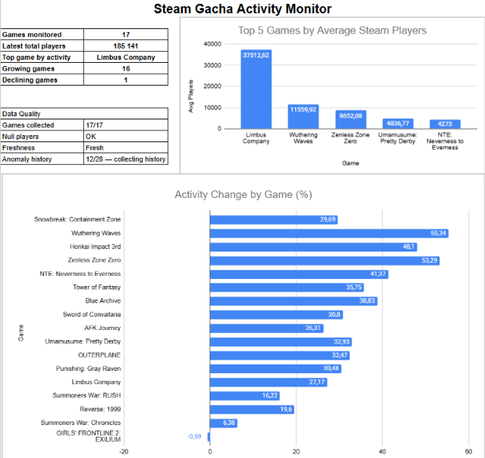
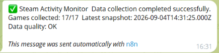
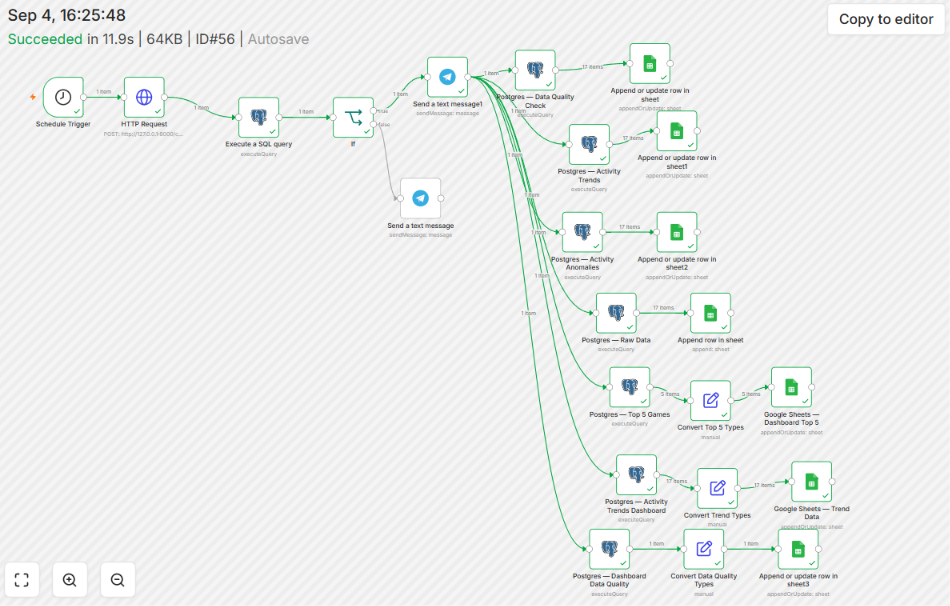
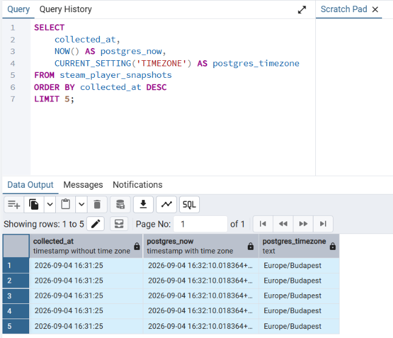

# Steam Gacha Activity Monitor

[](https://www.python.org/)
[](https://www.postgresql.org/)
[](https://fastapi.tiangolo.com/)
[](https://n8n.io/)
[](https://www.google.com/sheets/about/)
[](https://developer.valvesoftware.com/wiki/Steam_Web_API)
[](#project-status)

An automated monitoring and analytics pipeline for **gacha and live-service games on Steam**.

The project collects concurrent player data from the Steam Web API, stores historical snapshots in PostgreSQL, calculates activity and volatility metrics with SQL, performs statistical anomaly detection, validates data quality, sends Telegram alerts, and automatically updates a Google Sheets dashboard.

---

## Dashboard Preview



---

## Project Overview

The project answers the following business question:

> **How does player activity change across gacha and live-service games on Steam, and which titles demonstrate the highest, most stable, or most volatile engagement?**

Instead of analyzing a static dataset, this project implements a continuously growing monitoring system.

The pipeline automatically:

1. collects data from the Steam Web API;
2. stores timestamped snapshots;
3. calculates activity changes and trends;
4. measures player activity stability and volatility;
5. performs anomaly detection;
6. validates data quality;
7. sends operational alerts;
8. updates analytical reports and dashboards.

---

## Business Questions

The system is designed to answer:

* Which games have the highest concurrent player activity?
* Which games are growing or declining?
* Which titles demonstrate stable player activity?
* Which games are highly volatile?
* Which observations deviate significantly from historical behavior?
* Is the latest data complete and fresh?
* Is the automated data pipeline operating correctly?

---

# Architecture

```text
                         ┌─────────────────────┐
                         │     Steam Web API   │
                         └──────────┬──────────┘
                                    │
                                    ▼
                         ┌─────────────────────┐
                         │  Python Collector   │
                         │      requests       │
                         └──────────┬──────────┘
                                    │
                      ┌─────────────┴─────────────┐
                      ▼                           ▼
             ┌─────────────────┐         ┌─────────────────┐
             │   CSV Storage   │         │   PostgreSQL    │
             │ Raw snapshots   │         │ Historical DB   │
             └─────────────────┘         └────────┬────────┘
                                                  │
                                                  ▼
                                      ┌─────────────────────┐
                                      │    SQL Analytics    │
                                      │       Views         │
                                      └──────────┬──────────┘
                                                 │
                                                 ▼
                                      ┌─────────────────────┐
                                      │        n8n          │
                                      │   Orchestration     │
                                      └──────────┬──────────┘
                                                 │
                         ┌───────────────────────┼──────────────────────┐
                         ▼                       ▼                      ▼
                  ┌────────────┐         ┌──────────────┐      ┌──────────────┐
                  │  Telegram  │         │ Google Sheets│      │ Data Quality │
                  │   Alerts   │         │   Dashboard  │      │    Checks    │
                  └────────────┘         └──────────────┘      └──────────────┘
```

---

## Technology Stack

### Data Collection

* Python 3.14
* Requests
* Steam Web API
* REST API

### Data Storage

* PostgreSQL
* CSV

### Data Analysis

* SQL
* PostgreSQL CTEs
* Window functions
* Aggregations
* Statistical analysis
* Z-score anomaly detection

### Automation

* n8n
* Cron / Schedule Trigger
* HTTP Request
* PostgreSQL nodes
* Conditional logic
* Google Sheets integration
* Telegram integration

### API Layer

* FastAPI
* Uvicorn

### Reporting

* Google Sheets
* Spreadsheet formulas
* Automated data refresh
* Charts
* Dashboard

---

# Data Source

The primary data source is the **Steam Web API**.

The project uses the Steam endpoint for retrieving the current number of players for a game:

```text
https://api.steampowered.com/ISteamUserStats/GetNumberOfCurrentPlayers/v1/
```

The request is based on a Steam `appid`.

The endpoint returns the number of players currently playing the game on Steam.

### Important metric definition

`current_players` represents:

> **Concurrent players on Steam at the moment of data collection.**

It does **not** represent:

* total registered users;
* DAU;
* MAU;
* paying users;
* retention;
* total player population across all platforms.

Therefore, the analysis should be interpreted as **Steam activity monitoring**, not total audience measurement.

---

# Game Universe

The project currently monitors 17 active games.

| Game                        | Steam App ID | Category                      |
| --------------------------- | -----------: | ----------------------------- |
| Wuthering Waves             |      3513350 | Open-world Action RPG         |
| Zenless Zone Zero           |      4162040 | Action RPG                    |
| Honkai Impact 3rd           |      1671200 | Action RPG                    |
| Punishing: Gray Raven       |      4125930 | Action RPG                    |
| Blue Archive                |      3557620 | Tactical RPG                  |
| GIRLS' FRONTLINE 2: EXILIUM |      3347400 | Tactical RPG                  |
| Limbus Company              |      1973530 | Turn-based RPG                |
| Umamusume: Pretty Derby     |      3224770 | Character Collection / Racing |
| Snowbreak: Containment Zone |      2668080 | Shooter / RPG                 |
| Reverse: 1999               |      3092660 | Turn-based RPG                |
| AFK Journey                 |      4195600 | Idle / RPG                    |
| Tower of Fantasy            |      2064650 | Open-world RPG                |
| Sword of Convallaria        |      2526380 | Tactical RPG                  |
| NTE: Neverness to Everness  |      4508340 | Open-world Action RPG         |
| OUTERPLANE                  |      4247320 | Turn-based RPG                |
| Summoners War: Chronicles   |      2167580 | MMORPG / Character Collection |
| Summoners War: RUSH         |      3813590 | RPG / Auto-battler            |

An additional title is tracked in the project universe but is not currently included in active player monitoring:

| Game                | Steam App ID | Status   |
| ------------------- | -----------: | -------- |
| Arknights: Endfield |      4732690 | Upcoming |

---

# Data Collection

The collector is implemented in Python.

Each game is queried individually through the Steam API.

Simplified logic:

```python
for game in ACTIVE_GAMES:

    players = get_current_players(game["appid"])

    snapshot = {
        "collected_at": collected_at,
        "appid": game["appid"],
        "name": game["name"],
        "category": game["category"],
        "current_players": players
    }
```

Each collection run creates one timestamped snapshot containing data for all 17 active games.

Expected number of records per snapshot:

```text
17 games
17 unique appids
17 player observations
```

---

# Historical Data Model

The main PostgreSQL table is:

```text
steam_player_snapshots
```

Schema:

```sql
CREATE TABLE steam_player_snapshots (
    id BIGSERIAL PRIMARY KEY,
    collected_at TIMESTAMP NOT NULL,
    appid INTEGER NOT NULL,
    name TEXT NOT NULL,
    category TEXT,
    current_players INTEGER,
    created_at TIMESTAMP DEFAULT CURRENT_TIMESTAMP
);
```

Each row represents one observation:

```text
game + timestamp + current_players
```

As new snapshots are collected, the table grows into a historical time series.

For `N` snapshots:

```text
expected rows = 17 × N
```

For example:

```text
11 snapshots × 17 games = 187 rows
```

---

# Analytical Layer

The analytical layer is implemented using PostgreSQL Views.

The project contains six main analytical views.

---

## 1. `game_activity_changes`

Calculates changes between consecutive observations for each game.

Key fields:

```text
collected_at
appid
name
category
current_players
previous_players
player_change
change_percent
minutes_since_previous
previous_collected_at
```

The view uses PostgreSQL window functions, including:

```sql
LAG()
```

---

## 2. `game_activity_metrics`

Calculates descriptive statistics for each game:

```text
observations
avg_players
min_players
max_players
stddev_players
coefficient_of_variation
first_snapshot
last_snapshot
```

---

## 3. `game_activity_trends`

Compares the first and latest observations.

Key metrics:

```text
first_players
latest_players
total_change
total_change_percent
trend
```

Trend classification:

```text
Growing
Declining
Stable
```

Example:

```text
first_players = 6,598
latest_players = 9,925

total_change = +3,327
total_change_percent = +50.42%

trend = Growing
```

---

## 4. `game_activity_anomalies`

Provides the statistical foundation for anomaly detection.

It calculates:

```text
previous_players
historical_observations
baseline_avg
baseline_stddev
change_percent
z_score
anomaly_level
```

---

## 5. `game_stability_analysis`

Measures activity stability and classifies games as:

```text
Very stable
Stable
Volatile
Highly volatile
Insufficient history
```

The classification is based on the coefficient of variation.

---

## 6. `game_activity_ranking`

Combines the main activity, trend, and stability metrics into one analytical view.

This view powers:

* Game Ranking;
* Activity Trends;
* Dashboard data;
* further analysis.

---

# Key Metrics

## Average Concurrent Players

```text
AVG(current_players)
```

Measures the typical level of Steam activity across the available observation period.

---

## Player Change

```text
current_players - previous_players
```

Shows the absolute change between consecutive snapshots.

---

## Percentage Change

```text
100 ×
(current_players - previous_players)
/
previous_players
```

Provides a scale-independent measure of activity change.

---

## Standard Deviation

Measures the absolute variability of player activity.

---

## Coefficient of Variation

The coefficient of variation is used to compare volatility across games with different audience sizes.

```text
CV =
STDDEV(current_players)
/
AVG(current_players)
× 100%
```

A lower CV indicates more stable activity relative to the game's average player count.

---

## Activity Range

```text
Activity Range % =
(MAX(current_players) - MIN(current_players))
/
AVG(current_players)
× 100%
```

Measures the relative spread between the highest and lowest observed activity levels.

---

# Anomaly Detection

The project uses a rolling historical baseline to identify unusual player activity.

For each game, the current observation is compared against previous observations.

The historical window contains:

```text
28 previous observations
```

Before enough history is available, the system returns:

```text
Insufficient history
```

Once sufficient history has accumulated, the system calculates:

```text
Z-score =
(current_players - baseline_avg)
/
baseline_stddev
```

Classification:

```text
Z ≥ 2     → High anomaly

Z ≤ -2    → Low anomaly

otherwise → Normal
```

This approach allows the system to distinguish ordinary fluctuations from observations that are statistically unusual relative to the game's own historical behavior.

---

# Why 28 Observations?

The current scheduler runs every three hours:

```text
0 */3 * * *
```

This results in:

```text
8 snapshots per day
```

Therefore:

```text
28 observations ≈ 3.5 days
```

The threshold is intentionally used as a minimum amount of historical context before classifying anomalies.

---

# Automation with n8n

n8n acts as the orchestration layer of the project.

The automated workflow is:

```text
Schedule Trigger
       ↓
HTTP Request
       ↓
PostgreSQL Data Quality Check
       ↓
IF
   ↙       ↘
 TRUE     FALSE
   ↓         ↓
Telegram  Telegram
   ↓
Analytics
   ↓
Google Sheets
```

---

## Schedule

Current cron expression:

```text
0 */3 * * *
```

The workflow runs every three hours:

```text
00:00
03:00
06:00
09:00
12:00
15:00
18:00
21:00
```

The frequency can be increased when higher-resolution time series data is required.

---

# FastAPI Layer

FastAPI provides an API layer between n8n and the Python collector.

Endpoints:

```text
GET  /
POST /collect
```

### GET `/`

Returns:

```json
{
    "status": "running",
    "service": "Steam Gacha Monitor API"
}
```

### POST `/collect`

Triggers a new Steam data collection.

Successful response:

```json
{
    "status": "success",
    "message": "Steam snapshot collected"
}
```

---

# Data Quality

Data quality checks are integrated directly into the automated workflow.

The latest snapshot is validated for:

### Completeness

Expected:

```text
17 games
17 unique appids
```

### Null Values

The pipeline checks for missing `current_players`.

### Invalid Values

The pipeline checks for:

```text
negative player counts
empty game names
empty categories
```

### Freshness

The age of the latest snapshot is monitored.

### Historical Depth

The system tracks how many historical observations are available for anomaly detection.

---

# Data Quality Logic

A healthy collection produces:

```text
Games collected: 17/17
Null players: 0
Freshness: Fresh
```

If the checks fail, the workflow follows the alert branch instead of reporting a successful run.

---

# Telegram Monitoring

Telegram is used as an operational alerting layer.

A successful collection sends a confirmation message.

Example:

```text
✅ Steam Activity Monitor

Data collection completed successfully.

Games collected: 17/17

Latest snapshot:
2026-09-04 16:31:25

Data quality: OK
```

When data quality checks fail, the workflow sends a separate alert.

---

## Telegram Screenshot



---

# Google Sheets Reporting

Google Sheets acts as the reporting and visualization layer.

The automated workflow updates:

```text
Dashboard
Game Ranking
Activity Trends
Anomalies
Raw Data
Dashboard Data
Trend Data
Dashboard Charts Data
```

---

# Dashboard

The dashboard contains five main KPI indicators:

### Games Monitored

Number of games currently included in the monitoring universe.

```text
17
```

### Latest Total Players

Total concurrent players across all monitored games in the latest snapshot.

### Top Game by Activity

The game with the highest average concurrent player activity.

### Growing Games

Number of games classified as `Growing`.

### Declining Games

Number of games classified as `Declining`.

---

# Top 5 Games

The dashboard contains a ranking of the five games with the highest average concurrent player count.

SQL:

```sql
SELECT
    ROW_NUMBER() OVER (
        ORDER BY avg_players DESC
    ) AS rank,
    name,
    ROUND(avg_players::numeric, 2) AS avg_players
FROM game_activity_ranking
ORDER BY avg_players DESC
LIMIT 5;
```

Visualization:

```text
Top 5 Games by Average Steam Players
```

---

# Activity Dynamics

The second main dashboard visualization shows activity changes by game.

Metric:

```text
total_change_percent
```

This makes it possible to quickly identify:

* games with the strongest positive growth;
* games with declining activity;
* games with relatively stable activity.

---

# Data Quality Dashboard

Technical monitoring is displayed alongside the analytical KPIs.

Example:

```text
Data Quality

Games collected      17/17
Null players         OK
Freshness            Fresh
Anomaly history      X/28
```

This makes the dashboard useful not only for analysis but also for monitoring the reliability of the underlying data pipeline.

---

## Dashboard Screenshot


---

# Raw Data

The `Raw Data` sheet contains the latest collected snapshot.

Main fields:

```text
collected_at
appid
name
category
current_players
```

Historical snapshots are stored in PostgreSQL, while Google Sheets is used primarily as the reporting layer.

---

## Raw Data Screenshot


---

# Pipeline Screenshot

The complete n8n workflow demonstrates the automation layer:



---

# PostgreSQL Screenshot

Example PostgreSQL analytical output:



---

# Validation & Testing

The pipeline was tested end-to-end.

Validation included:

* Steam API response validation;
* successful collection of all 17 active games;
* PostgreSQL insertion;
* snapshot completeness;
* unique appid validation;
* null-value checks;
* negative-value checks;
* empty-name/category checks;
* duplicate detection;
* SQL View validation;
* n8n workflow execution;
* Telegram notification delivery;
* Google Sheets updates;
* dashboard refresh;
* historical snapshot accumulation.

For every complete snapshot:

```text
17 games
17 unique appids
17 observations
```

For `N` snapshots:

```text
17 × N database records
```

---

# Example Data Quality Check

```sql
SELECT
    COUNT(*) AS total_rows,
    COUNT(DISTINCT appid) AS unique_games,
    COUNT(DISTINCT collected_at) AS snapshots
FROM steam_player_snapshots;
```

Per-snapshot validation:

```sql
SELECT
    collected_at,
    COUNT(*) AS games,
    COUNT(DISTINCT appid) AS unique_games
FROM steam_player_snapshots
GROUP BY collected_at
ORDER BY collected_at;
```

Expected result for every snapshot:

```text
games = 17
unique_games = 17
```

---

# Project Structure

```text
steam_automation/
│
├── .venv/
│
├── data/
│   └── steam_snapshots.csv
│
├── logs/
│
├── scripts/
│   ├── games.py
│   ├── steam_api.py
│   └── collect_snapshot.py
│
├── sql/
│   ├── 01_schema.sql
│   ├── 02_activity_changes.sql
│   ├── 03_activity_metrics.sql
│   ├── 04_activity_trends.sql
│   ├── 05_anomaly_detection.sql
│   ├── 06_game_stability.sql
│   └── 07_game_ranking.sql
│
├── api.py
├── db.py
├── requirements.txt
├── .env
├── .env.example
├── .gitignore
├── README_RU.md
└── README.md
```

---

# Installation

## 1. Clone the repository

```bash
git clone <repository-url>
cd steam_automation
```

---

## 2. Create a virtual environment

```bash
python -m venv .venv
```

Windows:

```powershell
.\.venv\Scripts\Activate.ps1
```

---

## 3. Install dependencies

```bash
pip install -r requirements.txt
```

Required packages:

```text
requests
fastapi
uvicorn
psycopg2-binary
python-dotenv
```

---

# PostgreSQL Setup

Create a PostgreSQL database:

```text
steam_monitor
```

Then execute:

```text
sql/01_schema.sql
```

---

# Environment Variables

Create:

```text
.env
```

Example:

```env
DB_HOST=localhost
DB_PORT=5432
DB_NAME=steam_monitor
DB_USER=postgres
DB_PASSWORD=your_password
```

Credentials must not be committed to GitHub.

The repository contains:

```text
.env.example
```

as a configuration template.

---

# Create Analytical Views

Run the SQL scripts in the following order:

```text
01_schema.sql
02_activity_changes.sql
03_activity_metrics.sql
04_activity_trends.sql
05_anomaly_detection.sql
06_game_stability.sql
07_game_ranking.sql
```

---

# Run the Collector

Manual collection:

```powershell
python scripts/collect_snapshot.py
```

Expected result:

```text
Starting collection: ...

Active games to collect: 17

OK | Wuthering Waves | ...
OK | Zenless Zone Zero | ...
OK | Limbus Company | ...
...

Saved 17 records to data\steam_snapshots.csv
Saved 17 records to PostgreSQL
```

---

# Run FastAPI

Start the API:

```powershell
uvicorn api:app --host 127.0.0.1 --port 8000
```

API:

```text
http://127.0.0.1:8000/
```

Swagger documentation:

```text
http://127.0.0.1:8000/docs
```

---

# Run n8n Automation

The automated pipeline requires:

```text
FastAPI
PostgreSQL
n8n
```

to be available.

The current workflow uses:

```text
Schedule Trigger
        ↓
HTTP Request
        ↓
PostgreSQL
        ↓
IF
        ↓
Telegram
        ↓
Google Sheets
```

Because the current setup is local, the computer must remain running for scheduled executions.

---

# Security

Sensitive credentials are excluded from version control.

The `.gitignore` file excludes:

```text
.env
.env.*
```

The following should never be committed:

* database passwords;
* Telegram bot tokens;
* OAuth client secrets;
* access tokens;
* private credentials.

Only `.env.example` should be included in the repository.

---

# Limitations

## Steam-only Activity

The project measures Steam activity only.

It does not include users playing on:

* mobile;
* PlayStation;
* Xbox;
* other platforms.

Therefore, Steam concurrent players should not be interpreted as total game audience.

---

## Concurrent Players ≠ DAU / MAU

The Steam API metric represents players currently in the game.

It is not equivalent to:

```text
DAU
MAU
registered users
paying users
retention
```

---

## Limited Historical Period

Anomaly detection requires historical observations.

Before 28 previous observations are available:

```text
anomaly_level = Insufficient history
```

This is an intentional design decision.

---

## Sampling Frequency

The current sampling interval is:

```text
3 hours
```

Therefore, short-lived activity spikes may occur between observations and remain undetected.

Higher-frequency collection would provide a more granular time series but would also increase API requests and downstream processing.

---

## External API Dependency

The pipeline depends on the availability of the Steam Web API.

API errors may result in failed or incomplete collection runs.

Data quality checks are therefore included as part of the automation layer.

---

## Local Deployment

The current version runs locally.

The following services need to be available:

```text
PostgreSQL
FastAPI
n8n
```

A cloud deployment would be required for fully unattended 24/7 monitoring.

---

# Future Improvements

## Event Analysis

Combine player activity with:

* game updates;
* new characters;
* banners;
* collaborations;
* DLC;
* seasonal events;
* major patches.

This would make it possible to move from:

> "Player activity increased."

to:

> "Player activity increased after a specific game event."

---

## Time-of-Day Analysis

With a larger historical dataset, analyze:

```text
hour of day
day of week
weekday vs weekend
```

This could reveal recurring player activity patterns.

---

## Advanced Anomaly Detection

Potential future approaches:

* rolling mean;
* rolling standard deviation;
* EWMA;
* seasonal baselines;
* IQR;
* Isolation Forest;
* change-point detection.

---

## Cloud Deployment

A production-style architecture could move the local components to cloud infrastructure:

```text
Cloud Scheduler
      ↓
FastAPI
      ↓
PostgreSQL
      ↓
n8n
      ↓
Telegram / Dashboard
```

This would allow continuous monitoring without requiring a local computer to remain online.

---

## Power BI

The PostgreSQL analytical layer could also serve as a source for a Power BI dashboard.

Potential dashboard sections:

```text
Executive KPIs
Game Ranking
Activity Trends
Volatility
Anomalies
Category Analysis
Historical Activity
```

---

# What This Project Demonstrates

This project demonstrates practical experience with the complete data workflow:

```text
External API
     ↓
Data Collection
     ↓
Data Storage
     ↓
Data Quality
     ↓
SQL Transformation
     ↓
Statistical Analysis
     ↓
Anomaly Detection
     ↓
Automation
     ↓
Alerts
     ↓
Reporting
     ↓
Dashboard
```

### Key skills demonstrated

```text
Python
REST APIs
Steam Web API
PostgreSQL
SQL
CTEs
Window Functions
LAG()
FIRST_VALUE()
Aggregation
Statistical Analysis
Z-score
Anomaly Detection
Data Quality
FastAPI
n8n
Workflow Automation
Telegram
Google Sheets
Dashboarding
Data Pipeline Design
```

---

# Project Status

**Active MVP — automated data collection and reporting pipeline**

The end-to-end system is operational:

```text
Steam API
    ↓
Python Collector
    ↓
PostgreSQL
    ↓
SQL Analytics
    ↓
n8n
    ↓
Telegram
    ↓
Google Sheets
    ↓
Dashboard
```

Historical data continues to accumulate automatically.

Once enough historical observations are available, the anomaly detection layer will transition from:

```text
Insufficient history
```

to statistical anomaly monitoring.

---

# Portfolio Value

This project was designed as a portfolio case to demonstrate that data analysis can extend beyond working with a static dataset.

The project combines:

* **data acquisition** through an external API;
* **Python automation**;
* **relational data storage**;
* **advanced SQL analysis**;
* **statistical monitoring**;
* **data quality engineering**;
* **workflow orchestration**;
* **automated alerts**;
* **reporting and dashboarding**.

The result is a small but complete **automated analytics system** rather than a one-time analysis.

---

## Screenshots

| Component               | Preview                     |
| ----------------------- | --------------------------- |
| Google Sheets Dashboard | `images/dashboard.png`      |
| n8n Automation Pipeline | `images/pipeline.png`       |
| PostgreSQL Analytics    | `images/postgresql.png`     |
| Telegram Alert          | `images/telegram-alert.png` |
| Raw Data                | `images/raw-data.png`       |

